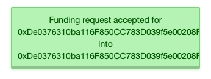
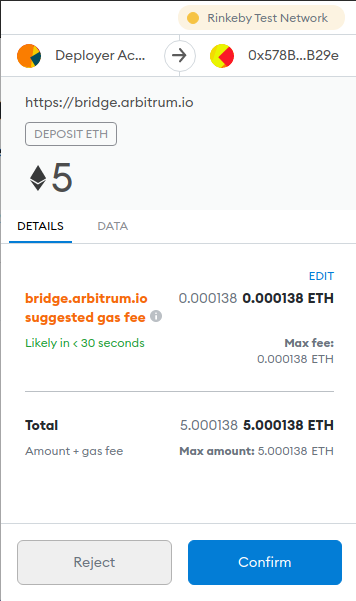
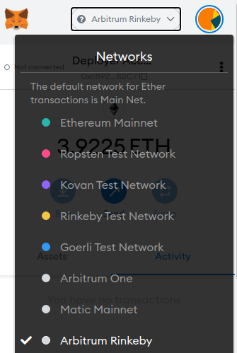
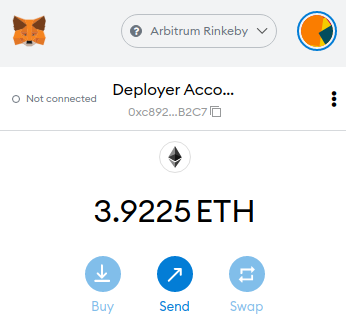

# Getting ETH on Arbitrum Testnet

To confirm any transaction on Arbitrum Testnet you need to own ETH tokens. ETH is the native coin for the Ethereum ecosystem. To get some test tokens for the Arbitrum Testnet, you first need to get tokens for the Ethereum Rinkeby testnet. Then you can migrate those tokens to the Arbitrum Testnet through a bridge.

To get Ethereum Rinkeby ETH tokens you can use the authenticated faucet at [https://faucet.rinkeby.io/](https://faucet.rinkeby.io/). This faucet requires you to write a public post on a social network profile you own. The content of the post must be the Wallet address you created in the [How to install Metamask section](how-to-install-metamask.md). Just click on the account name and it will copy the address for you:

Then post this address in a social network. For example you can use Twitter for this. Then copy the public URL of the post and paste it in the faucet input box:

Then click on the dropdown menu that says **Give me Ether** and select the amount you want \(the more you request the more time you have to wait until you can request again\):

After a bit you should see confirmation that the ETH tokens have arrived and you should see them in your wallet:

To see the tokens you will have to change your MetaMask network to **Rinkeby Test Network:**

This is one of Ethereum's Testnet. There you should see that you have some ETH tokens now:

Once you have the ETH tokens you can go to the **Arbitrum Testnet** bridge to transfer them to Arbitrum. Go to [https://bridge.arbitrum.io/](https://bridge.arbitrum.io/) and you should see a screen like this:

Make sure that the left column where says **ETH on L1** is enabled. There you can input how many ETH tokens you want to transfer to **Arbitrum:**

Click **Deposit** and a disclaimer will show:

Click **Proceed** and Metamask will ask you to confirm the transaction:

Click **Confirm** and wait until the transaction is confirmed. Then you can switch to the **Arbitrum Rinkeby** again in Metamask:

And wait until you see your ETH tokens have arrived:

Now you can start using The Anthill test website!

