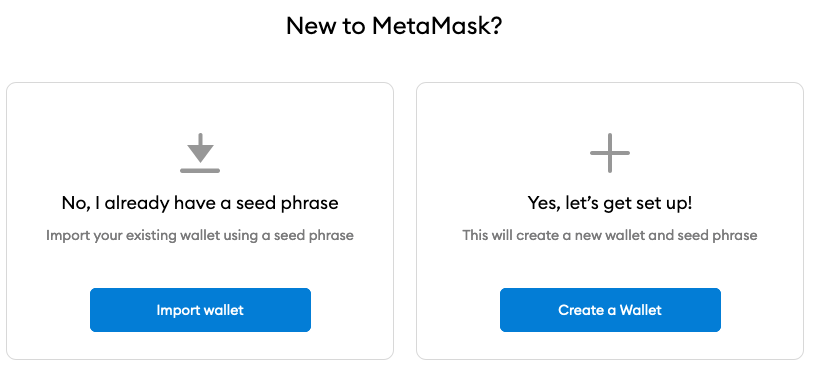

# How to install Metamask

Metamask is a digital wallet that allows you to interact with the blockchain network. It is used by a website to interface with the blockchain network and with the wallet information stored in the blockchain. By default Metamask connects to the Ethereum network, but it can be configured to connect to other networks as well.

This guide assumes you are using the Chrome browser. If using any other browser the process should be fairly similar for installing the extension. In order to install Metamask you must go to its download page [here](https://metamask.io/download.html).

.png>)

Click on **Install Metamask for Chrome.** This will bring you to the **Chrome Extensions** store. On the top right click the **Add to Chrome** button:

.png>)

Once added it will appear on the extensions menu on the top right of the browser:

.png>)

If it doesn't appear it could be that it needs to be pinned. On the same area of the browser, click on the extensions button:

.png>)

On the menu that pops up search for the Metamask icon and make sure that it is pinned by clicking on the **Pin** button next to it:

.png>)

The pin button should appear blue and the Metamask button should appear on the top right of the browser:

.png>)

Click on the Metamask button and it open a web page to welcome you and help you create your first wallet:

.png>)

Click on **Get Started.** It will ask you whether you are completely new to Metamask or whether you already have a Wallet:

If you already have a wallet you can import it through **Import Wallet**. If that is the case you should know how to continue to finish importing the wallet. If you are completely new click on **Create a Wallet.** Metamask will ask you about collecting some data for service improvement purposes:

.png>)

Read it carefully and click on the option that you feel comfortable with. Both options will allow you to continue with the setup. On the next page Metamask will ask you for a password to access the wallet:

.png>)

Use a unique password and store it securely either on a password manager like [Bitwarden](https://bitwarden.com/), Last Pass or 1Password (search for 'Password Manager' on Google for more options) or on a non-digital medium (piece of paper stored in a safe, hard-drive disconnected from the internet). In any case, make sure this password is not accessible by anyone else but you. The wallet you are about to create will contain all your crypto assets, including the Ant Token, and if anybody can access this password and your Metmask, it will have access to all your crypto assets. Once you've written and stored the password securely, fill it in the Metamask fields and click **Create.**

Now Metamask will show you your Wallet Seed (secret phrase). This is your actual wallet passcode. This seed is even more critical than the Metamask password. With this seed anybody, anywhere, could access your crypto wallet, even if they cannot access your Metamask. So make sure you store it safely in a non-digital medium (piece of paper inside a safe, a hard-drive disconnected from the Internet or on a Hardware Ledger). This is the last line of defence for your crypto assets. If your Wallet Seed is stolen, you cannot do anything to recover the assets.

.png>)

Click on **Click here to reveal secret words**, it will show you a list of words. Write them down in a secure place as mentioned before and keep them close just for the next step. Click **Next**. Now Metamask will ask you for the Seed back, to make sure you wrote them down correctly:

.png>)

Click on the words in the same order as you wrote them down. You need to enter all the words. Once finished click **Confirm.** If the **Confirm** button is not clickable, it means you entered the Seed phrase incorrectly. Review that the words you entered are in the same order as the ones you wrote. If everything seems the same, it is likely that you wrote down the seed phrase incorrectly in the previous step. Click **Back** and verify that the Seed you wrote down is the same as Metamask is showing you:

.png>)

Once the **Confirm** button is enabled and you click on it, Metamask will confirm that everything is OK and it will show you the **Congratulations** screen:

.png>)

Now you can store your Seed phrase securely. You will only need this phrase in case you lose access to your Metamask, in which case you will need to set up a new Metamask with the Seed phrase you stored.

Click on **All Done** and Metamask will bring you to the main screen. You can close the page and then click on the **Metamask** extension icon on the top right of the browser to bring up the extension:

.png>)

Congratulations! 🎉🎉🎉 You have successfully created your first Crypto Wallet! Now you can connect to **Anthill** and participate in the most awesome **Creators Token Economy** ever!! Before that please make sure to check first the following sections:

* [Connect to Binance Smart Chain network](metamask-add-binance-smart-chain-bsc-network.md)
* [Add the Ant Tokens addresses to Metamask](metmask-token-addresses.md)
* [Get free BNB tokens for the Test network](getting-bnb-on-binance-smart-chain-bsc-testnet.md)
