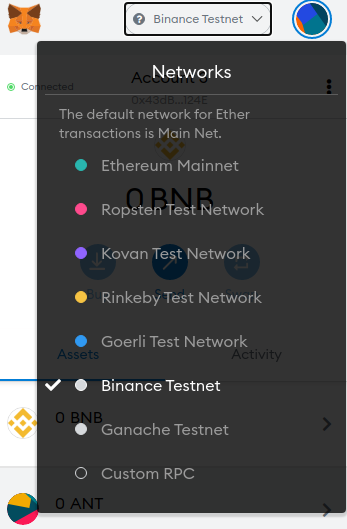
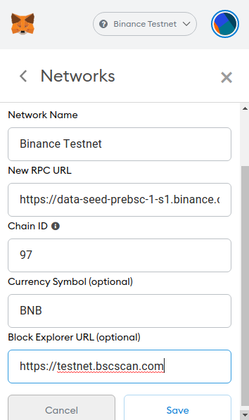

# Metamask: Add Binance Smart Chain \(BSC\) Network

To configure Metamask for the Binance Test Network we must add a new RPC Network. For this, open Metamask, access the accounts menu at the top-right corner and select Settings:

Scroll down to the Networks section and select it:

At the bottom click on Add Network and fill in the following data:

* **Network Name:**Binance Test
* **New RPC URL:**[https://data-seed-prebsc-1-s1.binance.org:8545/](https://data-seed-prebsc-1-s1.binance.org:8545/)
* **Chain ID:**97
* **Currency Symbol:**BNB
* **Block Explorer URL:**[https://testnet.bscscan.com](https://testnet.bscscan.com)

Finally select the **Binance Test** in Metamask's network selector \(drop down at the top of Metamask\):

You are connected to the **Binance Testnet** now.

