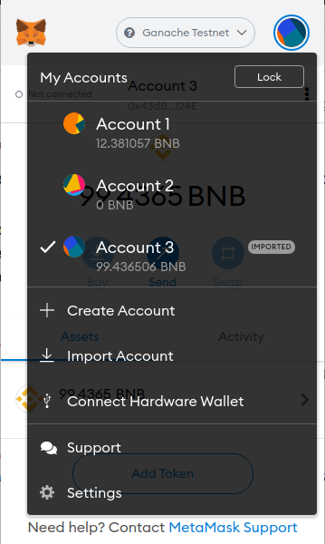
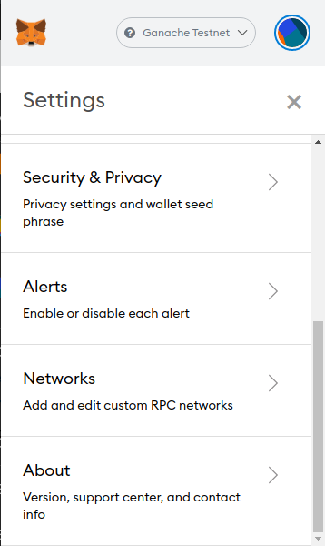

# Metamask: Add Arbitrum Testnet Network

To configure Metamask for the Arbitrum Test Network we must add a new RPC Network. For this, open Metamask, access the accounts menu at the top-right corner and select Settings:

Scroll down to the Networks section and select it:

At the bottom click on Add Network and fill in the following data:

* **Network Name:** Arbitrum Rinkeby
* **New RPC URL:** [https://rinkeby.arbitrum.io/rpc](https://rinkeby.arbitrum.io/rpc)
* **Chain ID: 421611**
* **Currency Symbol:** ETH
* **Block Explorer URL:** [https://testnet.bscscan.com](https://rinkeby-explorer.arbitrum.io/#/)

Finally select the **Arbitrum Rinkeby** in Metamask's network selector \(drop down at the top of Metamask\):

You are connected to the **Arbitrum Rinkeby** now.

